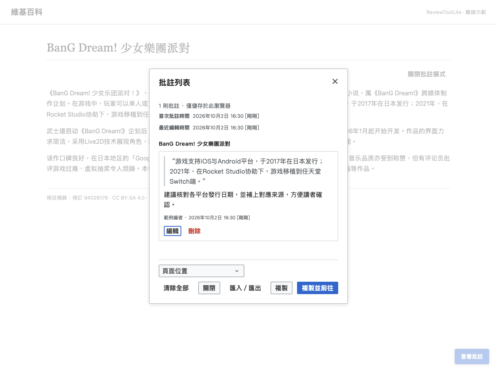

# ReviewToolLite

[English](README.md) · [繁體中文](README.zh-Hant.md) · [简体中文](README.zh-Hans.md)

ReviewToolLite helps you review Chinese Wikipedia articles sentence by sentence.
Select a passage, save a private comment, and copy your collected feedback as
wikitext for a talk page or review discussion.

<!-- toc:start -->

## Contents

- [Features](#features)
- [Installation](#installation)
- [How to use](#how-to-use)
  - [Your data](#your-data)
- [Screenshots](#screenshots)
- [Help](#help)
- [License](#license)

<!-- toc:end -->

## Features

- Comment on selected text or a whole sentence and return to comments beside the article.
- Inspect related citations and copy source, reference, and archive links.
- Sort your comments by article position or time, then copy a review with a permanent revision link.
- Export and import JSON backups, and undo the most recent clearing of comments.

## Installation

Choose one installation method. The following links always download the latest project distribution.

| Method               | Latest file                                                                                                                | How to use it                                                      |
| -------------------- | -------------------------------------------------------------------------------------------------------------------------- | ------------------------------------------------------------------ |
| Tampermonkey         | [ReviewToolLite.user.js](https://github.com/For-Each-Next/wp-revtool-lite/releases/download/latest/ReviewToolLite.user.js) | Open the link in Tampermonkey and confirm installation.            |
| Personal wiki script | [bundled.min.js](https://github.com/For-Each-Next/wp-revtool-lite/releases/download/latest/bundled.min.js)                 | Copy the downloaded compact file into your personal `common.js`.   |
| Readable script      | [bundled.js](https://github.com/For-Each-Next/wp-revtool-lite/releases/download/latest/bundled.js)                         | Inspect the readable code or run it once from the browser console. |

For personal wiki installation, open the downloaded `bundled.min.js`, copy its entire contents into your Chinese Wikipedia `common.js`, and save the page.

Use a current browser on Chinese Wikipedia. ReviewToolLite runs on article view
pages. Clipboard actions require clipboard permission. The userscript includes
readable code and Tampermonkey metadata.

To remove ReviewToolLite, disable or uninstall its Tampermonkey script, or remove its code from `common.js`, then reload the page. Export your comments first if you also plan to clear browser storage.

## How to use

1. Open an article and choose **Enable annotation mode** (「啟用批註模式」) in the page tools menu.
2. Click a sentence or select a passage, then click **Annotate** (「批註」).
3. Enter your feedback and click **Add** (「新增」).
4. Open **View annotations** (「查看批註」) to edit, back up, or copy your review.
5. Paste the copied wikitext into the destination page, check it, and submit it yourself.

The interface follows your Chinese language variant. Read the [usage guide](docs/usage.md)
for source links, input shortcuts, sorting, and review destinations.

### Your data

Comments stay in this browser on this wiki. Export a JSON backup before clearing
browser data or switching browsers. Importing a backup merges its comments into
the current article. **Clear all** can be undone once; deleting an individual
comment is permanent. Saving and copying do not submit wiki edits.

Read about [storage and backups](docs/storage.md).

## Screenshots

The screenshots use excerpts from the [BanG Dream! 少女樂團派對 article, revision 94028176](https://zh.wikipedia.org/w/index.php?oldid=94028176), in an offline page with illustrative feedback.
See the [screenshot source and reproduction notes](docs/screenshots.md).

## Help

See [troubleshooting](docs/troubleshooting.md), [supported pages](docs/configuration.md),
[release notes](CHANGELOG.md), or [report a problem](https://github.com/For-Each-Next/wp-revtool-lite/issues).
Contributor information is in [CONTRIBUTING.md](CONTRIBUTING.md).

## License

ReviewToolLite is based on [ReviewTool by SuperGrey](https://zh.wikipedia.org/wiki/User:SuperGrey/gadgets/ReviewTool).
It retains the original Quinn Gao copyright notice and [MIT license](LICENSE).
Article excerpts have their own [CC BY-SA 4.0 attribution](docs/screenshots.md).
