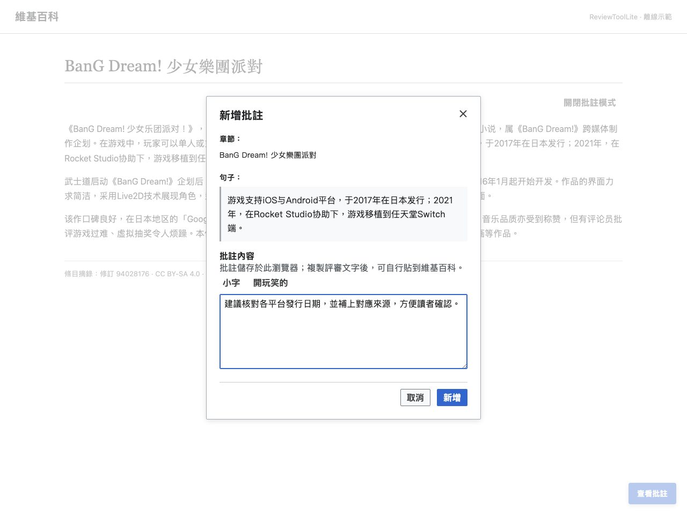
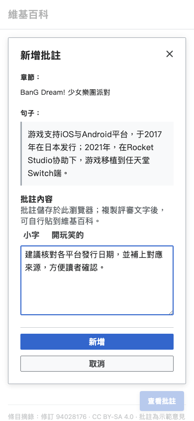
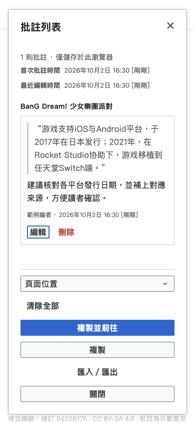

# 使用說明

先依 [README](../README.md) 載入工具，再在條目頁的「更多／工具」
選擇「啟用批註模式」。選單名稱和位置會隨維基百科外觀而變化。

<!-- toc:start -->

## Contents

- [新增與編輯批註](#新增與編輯批註)
- [批註輸入捷徑](#批註輸入捷徑)
- [複製來源](#複製來源)
- [整理與備份](#整理與備份)
- [複製評審文字](#複製評審文字)
- [介面範例](#介面範例)

<!-- toc:end -->

## 新增與編輯批註

拖曳選取要討論的文字，或點選一個句子，開啟「新增批註」。
對話框顯示章節、原文及可辨識的相關來源。
輸入意見並按「新增」；原文旁會出現批註圖示。
點選圖示，或從「查看批註」中的「編輯」開啟同一則批註。
原文圖示也可用 Tab 聚焦，再按 Enter 或空格開啟。

「取消」、關閉按鈕或 Escape 會放棄尚未儲存的輸入。
批註內容不可空白。新增、編輯或刪除時若出現儲存失敗訊息，
請先檢查[瀏覽器儲存空間](troubleshooting.md#無法儲存或匯入批註)。

每次載入頁面後，首次啟用批註模式時，若已有批註，
工具會詢問是否清除並開始新的評審。按「取消」可保留已有批註並繼續使用。
清除後，可從通知或批註列表按「復原清除」。
復原方式與限制見[儲存與備份](storage.md#清除與復原)。

## 批註輸入捷徑

| 操作                   | 結果                                             |
| ---------------------- | ------------------------------------------------ |
| 輸入 `<<文字>>`        | 轉成 `「{{仿宋体                                 | 1=文字}}」`。 |
| 「小字」               | 將選取文字包在 `<small>…</small>` 中。           |
| 「開玩笑的」           | 將選取文字包在附有提示的灰色刪除線 `` 中。 |
| 在有文字的行尾按 Enter | 自動為上一行補上 `* `，並在下一行延續點列標記。  |

使用「小字」或「開玩笑的」時若沒有選取文字，會在游標處插入標籤，
將游標放在標籤內。捷徑在中文輸入法完成組字後才處理文字。

## 複製來源

在批註模式中，將滑鼠移到註腳上，開啟旁邊的複製選單。
例如「複製12a」會複製單筆來源，「複製本組」會複製同組來源；
可用時包含存檔連結。註腳本身仍可正常開啟。

批註編輯器的「相關來源」列出與選取範圍相關的來源標題。
點選標題可另開來源，點選「複製22a」等按鈕可複製維基語法，
再貼入評語。若無法存取剪貼簿，編輯器會顯示可手動複製的文字。

## 整理與備份

「查看批註」開啟目前條目的批註列表。
預設依頁面位置排序，也可選擇最早或最新建立時間優先。
列表顯示批註總數，並提醒資料僅儲存於目前瀏覽器；空列表會提示如何新增或匯入。
列表顯示首次批註與最近編輯時間，使用瀏覽器的本機時區；
相對時間每分鐘更新。

從「匯入／匯出」下載 JSON 備份或匯入已有備份。
匯入會合併到目前條目，相同 ID 的批註會略過。
備份格式及跨瀏覽器使用方式見[儲存與備份](storage.md)。
「清除全部」會先要求確認；刪除單則批註也會先要求確認。
匯入、複製與資料修改進行時，介面會顯示進度並暫停衝突操作。
操作失敗時保留可讀的錯誤提示，待問題排除後可重試。

## 複製評審文字

按「複製」取得依頁面位置整理的評審維基語法。
文字包含原文、意見、章節連結、目前顯示版本的永久連結及簽名語法。
列表中的時間排序只改變顯示方式，不改變評審文字的頁面順序。
換行會轉為 ` `，段落分隔會轉為 `{{pb}}`，
`*` 點列會轉為編號評註下的子點列。

同一瀏覽器首次成功複製某條目的評審文字時，最上方會附上
`意見由[https://github.com/For-Each-Next/wp-revtool-lite ReviewToolLite]協助生成。`。
後續複製不再加入；清除網站儲存資料後可能再次出現。

「複製並前往」可前往討論頁、典範條目評選、特色列表評選、
優良條目評選或同行評審。只有複製成功才會跳轉；
評審頁會定位至本條目的章節。到達後請自行貼上、核對及提交。

複製評審文字時需要網路連線取得條目版本時間，
以及瀏覽器的剪貼簿支援。來源複製與備份不會自動提交任何維基編輯。

## 介面範例

以下使用指定的 BanG Dream! 條目摘錄與示範意見展示正式元件；畫面未連線至維基百科。
文章修訂、CC BY-SA 4.0 授權標示及重製指令見[截圖說明](screenshots.md)。
窄螢幕上的主要操作排在最上方，閱讀與鍵盤順序相同。

| 桌面                                                                      | 行動版                                                                   |
| ------------------------------------------------------------------------- | ------------------------------------------------------------------------ |
|                  |  |
|  |    |
